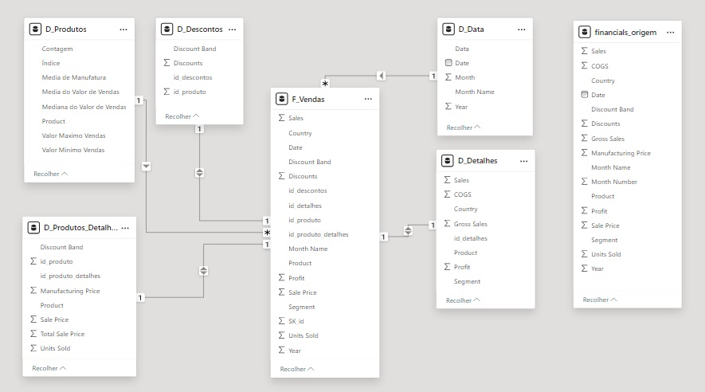

# Etapas
## Transformação de Dados
1. Para o começo do processo de modelagem, configurado os tipos de dados da tabela **financials**, de decimais para decimais fixos, quando necessário.
   
2. Criei duplicatas da tabela e renomeei a original para **financials_origem**; por último exclui a tabela **financials**.
  
3. Na primeira duplicata, colocado tabela dimensão com o nome de **D_Produtos**, fiz o agrupamento avançado dos registros pelo campo **Product** e fiz agregações:
    - `contagem`: total de linhas de registros por produto
    - `valor maximo vendas`: valor máximo de **Sales** por produto
    - `valor minimo vendas`:  valor mínimo de **Sales** por produto
    - `media de valor de vendas`: calcula a media de **Sales** agrupada por produto
    - `mediana do valor de vendas`: calcula a mediana de **Sales** agrupada por produto
    - `media de manufatura`: calcula a média de **Manufacturing Price** agrupada por produto
    
    Após isso, inserido uma coluna de índice a partir de 0, renomeado para **id_produto** e ordenado as colunas quando necessário.

4. Na segunda, nomeado **D_Descontos**, removi todas as colunas, exceto **Product**, **Discount Band** e **Discounts**, acrescentado uma coluna condicional, substituindo os valores de **Product** pelos seus respectivos _ids_, criados na tabela **D_Produtos** e então retirado a coluna **Product**.
    Ordenado as linhas de forma crescente por **id_produto**, **Discount Band** e **Discounts** e então inserido uma coluna de índice, chamada **id_descontos**.

5. Na terceira, **D_Produtos_Detalhes**, deixei somente as colunas **Product**, **Units Solds**, **Manufacturing Price**, **Sale Price** e **Discount Band**. Mantido a mesma sequência para ordenar os registros de forma crescente, com exceção da coluna **Manufacturing Price**. Inserido uma coluna índice com o nome de  **id_produto_detalhes**, substitui a coluna **Product** pelos seus ids e removido a anterior. Também incluído uma coluna personalizada que calcula o `valor total da venda`:
   
```
Total Sale Price = Table.AddColumn(#"Tipo Alterado", "Personalizar", each [Sale Price]*[Units Sold])
```
6. Na quarta, **D_Detalhes** (detalhes de vendas), as colunas **'Segment**, **Country**, **Product**, **Gross Sales**, **Sales**, **COGS** e **Profit**, ordenado de forma crescente por **Product**, **Segment**, **Country** e **Sales** e inserido uma coluna índice do 0, nomeado **id_detalhes**.

7. Na tabela fato, **F_Vendas**, removi **COGS**, **Month Number**, **Manufacturing Price** e **Gross Sales** e adicionado um índice, _SK_id_ (Surrogate Key).
    Para conseguir adicionar os devidos ids para as chaves estrangeiras **id_detalhes**, **id_descontos** e **id_produto_detalhes**, a ordenação da tabela de acordo com as suas respectivas tabelas, inserindo índices e renomeando-os de acordo com a necessidade, pois o PowerBI não permite o relacionamento por mais de um campo.
    Por fim, substituído **Product** por **id_produto**.

8. Nova conferência dos tipos de dados, ajustes na  disposição das colunas para visualização.

9. Acionado o botão **_Fechar e aplicar_** as alterações.

10. Já em **_Exibição de Modelo_**, inserido uma nova tabela **D_Data**, com o código em DAX:
```
D_Data = 
    ADDCOLUMNS(
        CALENDAR(DATE(2013, 1, 1), DATE(2014, 12, 31)),
        "Year", YEAR([Date]),
        "Month", MONTH([Date]),
        "Month Name", FORMAT([Date], "MMMM"), "Data", FORMAT([Date], "dd/mm/yyyy")
    )
```
> deixei as datas entre 2013 e 2014, pois os dados da tabela base estão nesse intervalo.

  Para o [Star Schema](https://learn.microsoft.com/pt-br/power-bi/guidance/star-schema), uma tabela de datas é essencial para a análise temporal dos dados, devido a consistência e granularidade de dados que ela confere.

## Relacionamentos
1. Em **_Gerenciar Relações_**, foi retirado todos os relacionamentos que haviam sido criados automaticamente e ficando da seguinte forma:
   
   

2. Ocultado **financials_origem**

3. Resultando no modelo:

   
