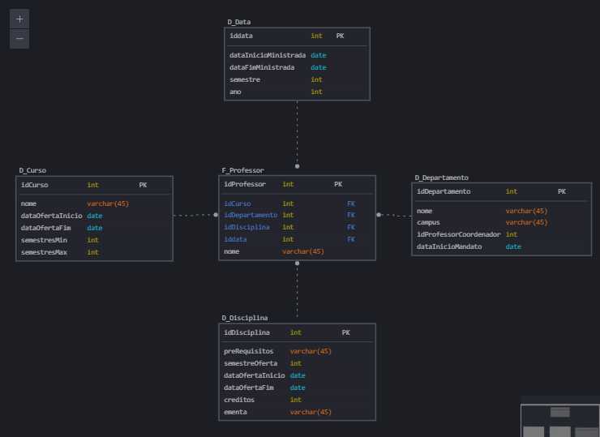

# Dashboard de Vendas com Power BI utilizando Star Schema

### Explicação da solução

Para resolver o desafio, com a exclusão da tabela aluno, concentrei as informações relevantes nas tabelas ligadas a Professor. Os pré-requisitos foram movidos para `D_Disciplina`, e `D_Curso` foi associado diretamente ao professor, simplificando a estrutura. Com isso, a tabela fato `F_Professor` ficou com o _ID do professor_, seu _nome_ e chaves estrangeiras para _idDisciplina_, _idCurso_, _ddata_ e _idDepartamento_.

A tabela `D_Data` registra quando o professor começou e terminou de lecionar uma disciplina específica de um curso, ligado a um departamento, além de guardar dados sobre o semestre e o ano, trazendo mais detalhes temporais. 

A imagem abaixo foi gerada com a ferramenta de modelagem : [SqlDBM](https://sqldbm.com/Home/).

 
